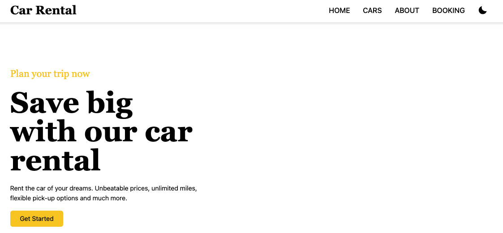
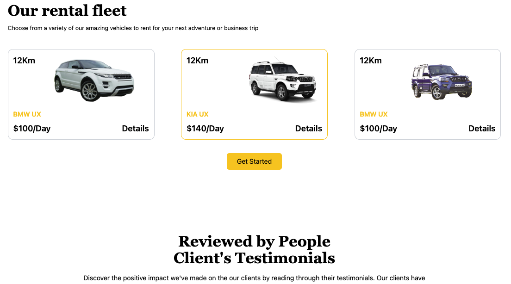

# Car Rental

## About the Project

A car rental website is an online platform that allows users to rent cars for personal or business use. The website provides an easy-to-use interface for searching, comparing, and reserving cars from a wide selection of vehicles that vary in make, model, size, and price.

👉 [Live Demo] (https://youtu.be/oBh5Ec_FWPY)

## Built with

- React JS
- Tailwind CSS
- Vite JS

## Screenshots of the Project

